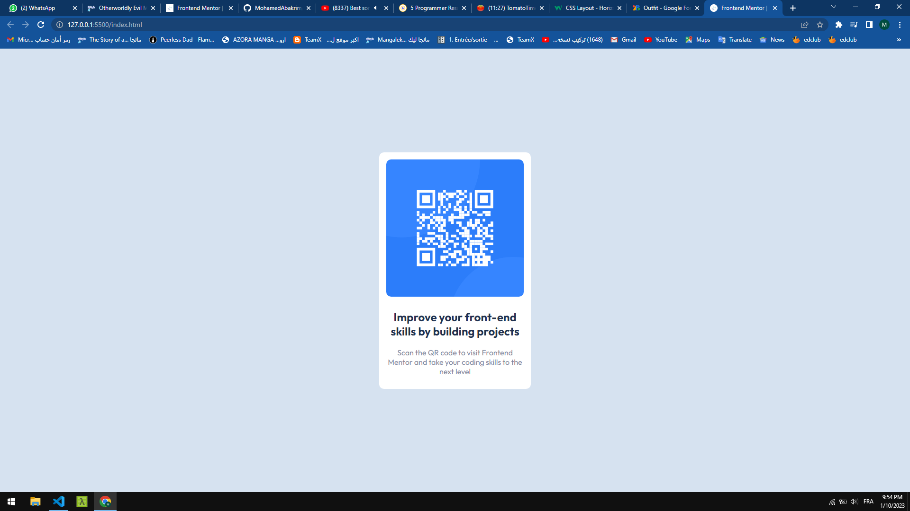
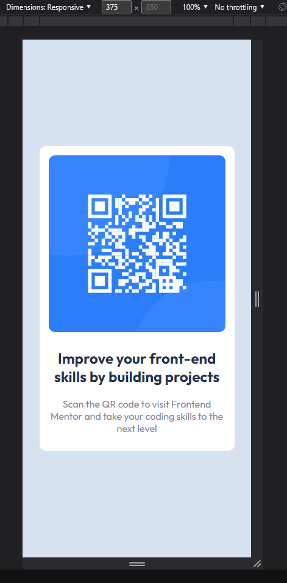

# Frontend Mentor - QR code component solution

This is a solution to the [QR code component challenge on Frontend Mentor](https://www.frontendmentor.io/challenges/qr-code-component-iux_sIO_H). Frontend Mentor challenges help you improve your coding skills by building realistic projects. 

## Table of contents

- [Overview](#overview)
  - [Screenshot](#screenshot)
  - [Links](#links)
- [My process](#my-process)
  - [Built with](#built-with)
  - [What I learned](#what-i-learned)
- [Author](#author)

## Overview

#### Screenshot of desktop preview



#### Screenshot of mobile preview




### Links

- Live Site URL: [https://mohamedabakrim.github.io/front_end_project1/](https://mohamedabakrim.github.io/front_end_project1/)

## My process

### Built with

- Semantic HTML5 markup
- CSS custom properties
- Flexbox


### What I learned

to center an element in the middle of the page we can use the position and transform

To see how you can add code snippets, see below:

```html
<div>
  
</div>
```
```css
div{
    position: absolute;
    top: 50%;
    left: 50%;
    transform: translate(-50%, -50%);
}
```
## Author

- Frontend Mentor - [@JirayaAbakrim](https://www.frontendmentor.io/profile/JirayaAbakrim)
- Github - [@MohamedAbakrim](https://github.com/MohamedAbakrim)